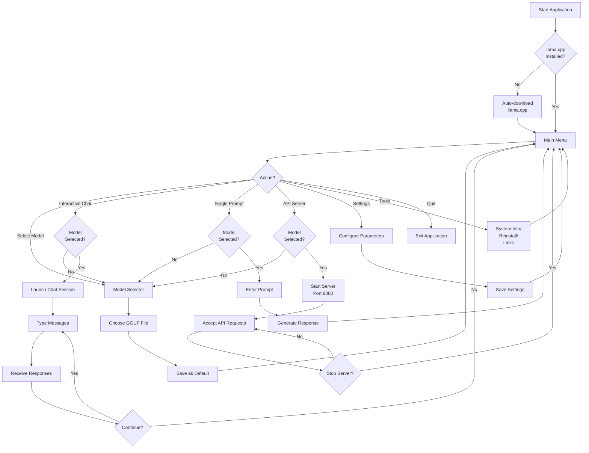
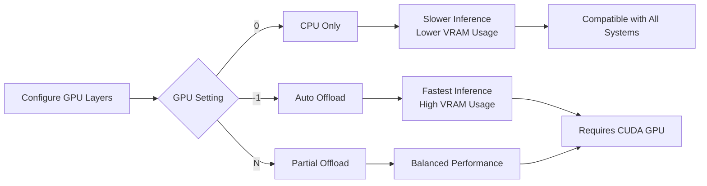
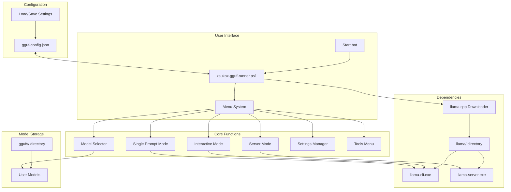

# xsukax CLI GGUF Runner

A complete, menu-driven AI model interface for Windows that simplifies running local GGUF language models with llama.cpp. This tool automatically manages dependencies, provides multiple interaction modes, and prioritizes user privacy through fully offline operation.

## Project Overview

xsukax CLI GGUF Runner is a PowerShell-based application that provides a user-friendly command-line interface for running GGUF (GPT-Generated Unified Format) language models locally on Windows systems. The application eliminates the complexity of manually configuring llama.cpp by automatically downloading and managing the required binaries, offering an intuitive menu system, and supporting multiple operational modes including interactive chat, single-prompt generation, and OpenAI-compatible API server functionality.

Key capabilities include:
- **Automatic dependency management** - Downloads and configures llama.cpp (version b7839) without manual intervention
- **Model agnostic operation** - Works with any GGUF-format model from HuggingFace, TheBloke, Bartowski, and other repositories
- **Multiple interaction modes** - Interactive chat sessions, one-shot prompt generation, and API server deployment
- **Persistent configuration** - Saves user preferences including model selection, context size, temperature, GPU settings, and thread allocation
- **Cross-platform model support** - Compatible with quantized models from Q2 to Q8 precision levels

## Security and Privacy Benefits

This application is designed with a privacy-first architecture that ensures complete data sovereignty and security:

### Local-Only Processing
All model inference occurs entirely on the user's local machine with zero external network communication during operation. User prompts, model responses, and conversation history never leave the local system, providing absolute privacy protection against data harvesting, surveillance, or unauthorized access.

### No Telemetry or Tracking
The application contains no analytics, telemetry, or tracking mechanisms. No usage statistics, error reports, or behavioral data are collected, transmitted, or stored externally. Users maintain complete anonymity and operational privacy.

### Dependency Transparency
The application downloads llama.cpp binaries directly from the official GitHub repository (https://github.com/ggerganov/llama.cpp) using predictable, versioned URLs. All downloads occur over HTTPS with standard system certificate validation. Users can audit network activity and verify that no data exfiltration occurs during setup.

### Isolated Execution Environment
All application files, configuration data, and model files reside within the installation directory. The application creates only two subdirectories (`llama/` for binaries and `ggufs/` for models) and one configuration file (`gguf-config.json`). No system-wide modifications, registry changes, or hidden files are created.

### Open Source Transparency
Released under GNU General Public License v3.0, the entire source code is available for security audit and verification. Users can inspect every function, validate data handling practices, and confirm the absence of backdoors or malicious functionality.

### Secure Configuration Storage
User preferences are stored in plain JSON format (`gguf-config.json`) within the application directory. No credentials, API keys, or sensitive information are required or stored. Configuration data includes only benign parameters such as temperature, context size, and model paths.

### No Account or Authentication Required
The application operates completely standalone without requiring user accounts, authentication, or online services. This eliminates risks associated with credential theft, account compromise, or service provider data breaches.

## Features and Advantages

### User Experience
- **Zero-configuration startup** - Automatic detection and installation of required llama.cpp binaries
- **Intuitive menu interface** - Color-coded, hierarchical menus with clear status indicators
- **Model management** - Built-in model selector with validation and persistence
- **Helpful documentation** - Integrated help screens with quick start guides and troubleshooting tips

### Performance Optimization
- **GPU acceleration support** - Configurable GPU layer offloading for CUDA-compatible NVIDIA GPUs
- **Flexible CPU threading** - Adjustable thread count for optimal CPU utilization
- **Context size control** - Configurable context windows from 512 to 32768+ tokens
- **Memory efficiency** - Support for highly quantized models (Q4_K_M, Q5_K_M) suitable for resource-constrained systems

### Operational Modes
- **Interactive chat mode** - Multi-turn conversations with conversation history and context management
- **Single prompt mode** - One-shot text generation for scripts and automation workflows
- **API server mode** - OpenAI-compatible HTTP endpoint (port 8080 default) for integration with third-party applications

### Advanced Configuration
- **Temperature control** - Adjustable output randomness from 0.0 (deterministic) to 2.0 (creative)
- **Token limits** - Configurable maximum generation length (default 2048 tokens)
- **Model switching** - Quick model selection with automatic configuration persistence
- **Settings management** - Export/import of configuration with one-click reset to defaults

### Developer-Friendly
- **PowerShell scripting** - Extensible PowerShell codebase with modular function architecture
- **Command-line support** - Help flag (`-Help`) for syntax reference
- **Error handling** - Comprehensive error detection with user-friendly messages
- **Portable design** - Self-contained installation with no system dependencies beyond PowerShell 5.1+

## Installation Instructions

### Prerequisites
- **Operating System**: Windows 10 or Windows 11 (64-bit)
- **PowerShell**: Version 5.1 or higher (pre-installed on modern Windows systems)
- **Disk Space**: Minimum 500MB for llama.cpp binaries, plus storage for GGUF models (2GB-20GB per model depending on size and quantization)
- **Hardware**: 
  - CPU: 64-bit processor (Intel/AMD)
  - RAM: Minimum 8GB (16GB+ recommended for larger models)
  - GPU: Optional - NVIDIA GPU with CUDA support for GPU acceleration

### Step-by-Step Installation

1. **Download the Application**
   
   Clone or download the repository from GitHub:
   ```bash
   git clone https://github.com/xsukax/xsukax-CLI-GGUF-Runner.git
   ```
   
   Or download as ZIP and extract to your desired location (e.g., `C:\AI\GGUF-Runner\`)

2. **Verify File Structure**
   
   Ensure the following files are present in the installation directory:
   ```
   xsukax-CLI-GGUF-Runner/
   ├── xsukax-gguf-runner.ps1
   └── Start.bat
   ```

3. **Download GGUF Models**
   
   Obtain GGUF models from trusted sources:
   - HuggingFace: https://huggingface.co/models?library=gguf
   - TheBloke: https://huggingface.co/TheBloke
   - Bartowski: https://huggingface.co/bartowski
   
   Download `.gguf` files to a temporary location.

4. **Create Models Directory**
   
   The application will automatically create the `ggufs/` directory on first run, or you can create it manually:
   ```
   xsukax-CLI-GGUF-Runner/
   ├── ggufs/
   │   └── (place your .gguf model files here)
   ├── xsukax-gguf-runner.ps1
   └── Start.bat
   ```

5. **Place Models**
   
   Copy your downloaded `.gguf` model files into the `ggufs/` directory.

### First Run

Execute the application using one of the following methods:

**Method 1: Double-click Start.bat** (Recommended for most users)
- Simply double-click `Start.bat` in Windows Explorer
- This method automatically bypasses PowerShell execution policy restrictions

**Method 2: PowerShell command**
```powershell
powershell -ExecutionPolicy Bypass -File .\xsukax-gguf-runner.ps1
```

**Method 3: Help command**
```powershell
powershell -ExecutionPolicy Bypass -File .\xsukax-gguf-runner.ps1 -Help
```

On first execution:
1. The application will display the xsukax logo and main menu
2. Automatically detect if llama.cpp binaries are missing
3. Prompt for automatic download and installation of llama.cpp (version b7839)
4. Create `llama/` directory and download required executables (`llama-cli.exe`, `llama-server.exe`)
5. Display the main menu ready for model selection and usage

## Usage Guide

### Basic Workflow



### Interactive Chat Mode

Launch a multi-turn conversation session:

1. From the Main Menu, select option **1** (Interactive Chat)
2. If no model is selected, the Model Selector will appear
3. Choose a model by entering its corresponding number
4. The chat interface will launch with the selected model
5. Type your messages and press Enter to receive responses
6. Type `exit`, `quit`, or press Ctrl+C to end the session and return to the main menu

**Example interaction:**
```
You: What is the capital of France?
Assistant: The capital of France is Paris.

You: Tell me three interesting facts about it.
Assistant: Here are three interesting facts about Paris:
1. The Eiffel Tower was originally intended to be temporary...
2. Paris has over 130 museums...
3. The city's metro system is one of the oldest in the world...

You: exit
[Returns to Main Menu]
```

### Single Prompt Mode

Execute one-shot text generation:

1. From the Main Menu, select option **2** (Single Prompt)
2. Select a model if not already chosen
3. Enter your prompt when requested
4. The model generates a response
5. Automatically returns to the main menu after completion

**Use cases:**
- Script automation
- Batch text generation
- Quick answers without conversation context

### API Server Mode

Deploy an OpenAI-compatible HTTP endpoint:

1. From the Main Menu, select option **3** (API Server)
2. Select a model if not already chosen
3. The server starts on port 8080 (configurable in Settings)
4. Access the API at `http://localhost:8080/v1/chat/completions`
5. Press any key to stop the server and return to the main menu

**API compatibility:**
- OpenAI Chat Completions API format
- JSON request/response
- Integration with tools like LibreChat, SillyTavern, or custom applications

**Example API request:**
```bash
curl http://localhost:8080/v1/chat/completions \
  -H "Content-Type: application/json" \
  -d '{
    "messages": [{"role": "user", "content": "Hello!"}],
    "temperature": 0.8
  }'
```

### Model Selection

Manage GGUF models:

1. From the Main Menu, select **M** (Select Model)
2. The application scans the `ggufs/` directory
3. Available models are displayed with index numbers
4. Enter the number corresponding to your desired model
5. The selected model becomes the default for all modes

**Model selector output example:**
```
Available Models:
  [1] llama-2-7b-chat.Q4_K_M.gguf (3.5 GB)
  [2] mistral-7b-instruct-v0.2.Q5_K_M.gguf (4.8 GB)
  [3] phi-3-mini-4k-instruct.Q4_K_M.gguf (2.3 GB)
```

### Settings Configuration

Customize operational parameters:

1. From the Main Menu, select **S** (Settings)
2. Choose a setting category:
   - **1** - Temperature (0.0-2.0, default 0.8)
   - **2** - Context Size (512-32768, default 4096)
   - **3** - Max Tokens (100-8192, default 2048)
   - **4** - GPU Layers (0=CPU, -1=Auto, N=Specific count)
   - **5** - Server Port (1024-65535, default 8080)
   - **6** - CPU Threads (0=Auto, N=Specific count)
   - **R** - Reset all settings to defaults
3. Enter new values when prompted
4. Settings are saved automatically to `gguf-config.json`

**Configuration file structure (gguf-config.json):**
```json
{
  "Temperature": 0.8,
  "ContextSize": 4096,
  "MaxTokens": 2048,
  "GpuLayers": 0,
  "ServerPort": 8080,
  "Threads": 0,
  "LastModel": "C:\\AI\\GGUF-Runner\\ggufs\\llama-2-7b.gguf"
}
```

### Tools and Information

Access system utilities:

1. From the Main Menu, select **T** (Tools and Info)
2. View system status (llama-cli, llama-server, model count)
3. Available tools:
   - **1** - Reinstall llama.cpp (redownload binaries)
   - **2** - Open models folder in Windows Explorer
   - **3** - Open llama folder in Windows Explorer
   - **4** - Display model download source links

### Performance Optimization

#### GPU Acceleration (NVIDIA GPUs with CUDA)

Enable GPU acceleration for faster inference:

1. Navigate to Settings → GPU Layers
2. Configuration options:
   - `0` - CPU only (default, maximum compatibility)
   - `-1` - Auto (offload all layers to GPU, recommended for CUDA GPUs)
   - `N` - Specific layer count (e.g., `20` offloads 20 layers to GPU)
3. Save settings and restart model inference

**GPU acceleration workflow:**



#### Low Memory Systems

Optimize for systems with limited RAM:

1. **Use smaller quantizations**: Q4_K_M or Q3_K_M models
2. **Reduce context size**: Set to 2048 or lower in Settings
3. **Choose smaller models**: 1B-3B parameter models (e.g., Phi-2, Qwen-1.8B)
4. **Close background applications**: Maximize available system RAM
5. **Disable GPU offloading**: Set GPU layers to 0 to avoid VRAM allocation

**Memory usage estimates:**
- 7B Q4_K_M model, 4096 context: ~6GB RAM
- 7B Q4_K_M model, 2048 context: ~4GB RAM
- 3B Q4_K_M model, 2048 context: ~2.5GB RAM

### Application Architecture



### Command-Line Reference

For script automation and advanced usage:

```powershell
# Display help information
powershell -ExecutionPolicy Bypass -File .\xsukax-gguf-runner.ps1 -Help

# Standard interactive launch
powershell -ExecutionPolicy Bypass -File .\xsukax-gguf-runner.ps1

# Launch via batch file (bypasses execution policy automatically)
Start.bat
```

### Troubleshooting

**Problem**: "llama-cli.exe not found" error

**Solution**: Select option **1** from the Tools menu to reinstall llama.cpp binaries

---

**Problem**: Model fails to load with "out of memory" error

**Solution**: 
- Reduce context size in Settings (try 2048 or 1024)
- Use a smaller quantized model (Q4_K_M or Q3_K_M)
- Close memory-intensive applications

---

**Problem**: GPU acceleration not working

**Solution**:
- Verify NVIDIA GPU with CUDA support is installed
- Ensure CUDA drivers are up to date
- Try setting GPU layers to `-1` for auto-detection
- If issues persist, set GPU layers to `0` for CPU-only mode

---

**Problem**: Server mode port already in use

**Solution**:
- Change Server Port in Settings to an unused port (e.g., 8081, 8090)
- Close applications using port 8080
- Check for running instances of llama-server.exe in Task Manager

---

**Problem**: Models not appearing in selector

**Solution**:
- Verify `.gguf` files are placed in the `ggufs/` directory
- Check file extensions are exactly `.gguf` (not `.gguf.txt` or similar)
- Restart the application to refresh model detection

## Licensing Information

This project is licensed under the GNU General Public License v3.0.

---

## Additional Resources

**Model Repositories:**
- HuggingFace GGUF Models: https://huggingface.co/models?library=gguf
- TheBloke Quantized Models: https://huggingface.co/TheBloke
- Bartowski Models: https://huggingface.co/bartowski

**llama.cpp Documentation:**
- Official Repository: https://github.com/ggerganov/llama.cpp
- Quantization Guide: https://github.com/ggerganov/llama.cpp/blob/master/examples/quantize/README.md

**Community Support:**
- GitHub Issues: https://github.com/xsukax/xsukax-CLI-GGUF-Runner/issues
- llama.cpp Discord: https://discord.gg/llama-cpp

---

**Version**: 2.0.0  
**Author**: xsukax  
**Repository**: https://github.com/xsukax/xsukax-CLI-GGUF-Runner
