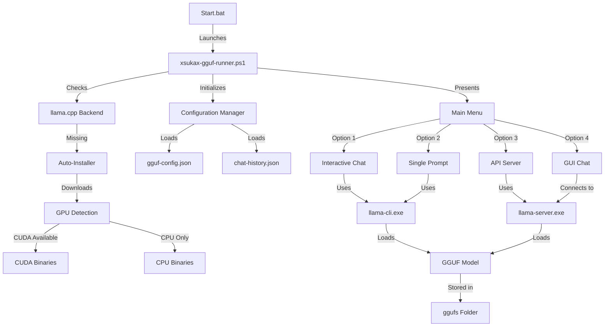
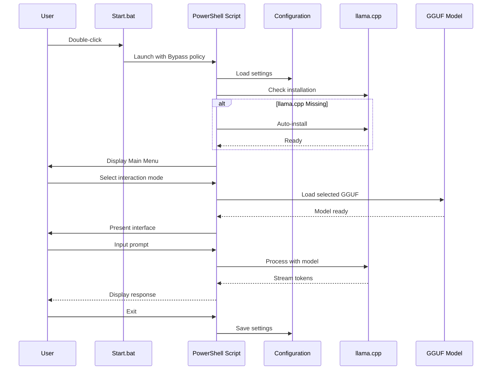
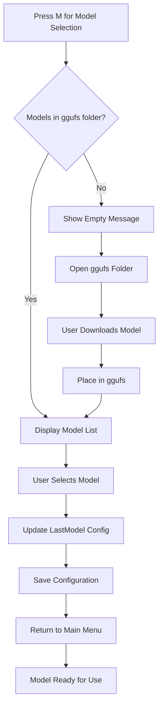

# xsukax GGUF Runner

**A Complete, Privacy-Focused AI Model Interface for Windows**

[](https://www.gnu.org/licenses/gpl-3.0)
[](https://github.com/xsukax/xsukax-GGUF-Runner)
[](https://github.com/xsukax/xsukax-GGUF-Runner)

## 📋 Project Overview

xsukax GGUF Runner is a menu-driven PowerShell application that provides a complete interface for running local AI language models in GGUF format on Windows systems. The tool automatically manages the llama.cpp backend, handles model deployment, and offers multiple interaction modes including an interactive console chat, single-shot prompts, API server, and a smooth-streaming GUI client.

This application eliminates the complexity of manual llama.cpp setup by providing automated installation, intuitive configuration management, and a polished user experience for both technical and non-technical users who want to run AI models locally on their own hardware.


---


### Primary Purpose

- **Local AI Deployment**: Run large language models entirely on your local machine without cloud dependencies
- **Simplified Management**: Automated llama.cpp installation and model management through an intuitive menu system
- **Multiple Interaction Modes**: Choose from CLI chat, GUI interface, API server, or single-prompt execution
- **Hardware Optimization**: Automatic GPU detection with support for both CUDA-accelerated and CPU-only operation

## 🔒 Security and Privacy Benefits

xsukax GGUF Runner is designed with privacy and security as fundamental principles:

### Complete Local Processing
All AI inference happens entirely on your local machine. Your prompts, conversations, and generated responses never leave your computer, eliminating the risk of data exposure to third-party services, cloud providers, or external APIs.

### No External Dependencies
The application operates in a fully offline mode once the initial llama.cpp binaries are downloaded. No telemetry, analytics, or external network calls are made during normal operation, ensuring complete isolation of your AI interactions.

### Transparent Source Code
As an open-source tool licensed under GPL v3.0, every line of code is publicly auditable. Users can verify exactly what the application does, ensuring no hidden data collection, tracking mechanisms, or security vulnerabilities exist in the codebase.

### Local Data Storage
Chat histories and configuration files are stored locally in plain JSON format within the application directory. You maintain complete control over your data with the ability to review, backup, or delete conversation histories at any time.

### Secure Configuration Management
All settings including model paths, server ports, and inference parameters are stored in local configuration files (`gguf-config.json` and `chat-history.json`). No credentials, API keys, or sensitive information is required to operate the application.

### Network Isolation Options
When running in interactive or GUI chat modes, the application operates entirely without network connectivity. The optional API server mode runs on localhost by default (port 8080), preventing external network access unless explicitly configured.

### No User Tracking
The application contains no user identification, session tracking, or usage analytics. Each execution is independent with no persistent user profiling or behavior monitoring.

## ✨ Features and Advantages

### Automatic Backend Management
- **One-Click llama.cpp Installation**: Automatically downloads and extracts the correct llama.cpp binaries (CUDA or CPU version) based on your hardware
- **GPU Auto-Detection**: Identifies NVIDIA GPUs and installs CUDA-optimized binaries when available
- **Version Management**: Maintains llama.cpp version b7839 with option to reinstall or update

### Comprehensive Interaction Modes
1. **Interactive Chat**: Console-based conversational interface with chat history
2. **Single Prompt**: Execute one-off queries for quick AI responses
3. **API Server**: Host a local OpenAI-compatible API endpoint for integration with other tools
4. **GUI Chat Client**: Windows Forms-based interface with smooth streaming text output

### Advanced Streaming Technology
- **Smooth Text Rendering**: Win32 API integration for flicker-free, smooth token-by-token streaming
- **Real-time Response Generation**: See AI output as it's generated, not after completion
- **Responsive Controls**: Stop generation mid-stream with dedicated stop button

### Flexible Configuration
- **Context Window Control**: Adjustable from 512 to 131,072 tokens
- **Temperature Settings**: Fine-tune creativity from 0.0 to 2.0
- **GPU Layer Configuration**: Choose CPU-only, auto GPU, or specify exact layer offloading
- **Thread Management**: Auto-detect CPU cores or manually specify thread count
- **Persistent Settings**: All configurations saved automatically between sessions

### Model Management
- **GGUF Model Support**: Compatible with all GGUF-format models from HuggingFace
- **Organized Storage**: Dedicated `ggufs` folder for model organization
- **Model Selection Memory**: Automatically remembers your last used model
- **Multiple Model Support**: Switch between different models easily

### Developer-Friendly
- **OpenAI-Compatible API**: Standard API endpoint for integration with existing tools
- **JSON Configuration**: Human-readable configuration files for easy customization
- **Extensible Architecture**: Clean PowerShell code structure for modifications

### User Experience
- **Colorful CLI Interface**: Intuitive color-coded menus and status messages
- **Status Indicators**: Real-time display of selected model, context size, and GPU mode
- **Error Handling**: Graceful error recovery with informative messages
- **Progress Feedback**: Clear indicators during downloads and long operations

## 📦 Installation Instructions

### Prerequisites

- **Operating System**: Windows 10 or Windows 11
- **PowerShell**: Version 5.1 or later (included with Windows)
- **Storage**: Minimum 500 MB free space (plus space for AI models)
- **Optional**: NVIDIA GPU with CUDA support for accelerated inference

### Step-by-Step Installation

1. **Download the Application**
   
   Clone or download this repository to your local machine:
   ```powershell
   git clone https://github.com/xsukax/xsukax-GGUF-Runner.git
   cd xsukax-GGUF-Runner
   ```

   Alternatively, download the ZIP file from GitHub and extract it to your desired location.

2. **Verify Files**
   
   Ensure the following files are present in the directory:
   - `xsukax-gguf-runner.ps1` - Main PowerShell script
   - `Start.bat` - Convenient launcher batch file
   - `Start-GPU.bat` - Convenient launcher batch file With GPU Support

3. **Launch the Application**
   
   Double-click `Start.bat` or `Start-GPU.bat` to launch the application with the correct execution policy.
   
   **Alternative launch methods:**
   
   Via PowerShell directly:
   ```powershell
   powershell -ExecutionPolicy Bypass -File .\xsukax-gguf-runner.ps1
   ```
   
   From PowerShell console:
   ```powershell
   .\xsukax-gguf-runner.ps1
   ```

4. **First-Run Setup**
   
   On first launch, the application will:
   - Create necessary directories (`llama`, `ggufs`)
   - Prompt to install llama.cpp binaries automatically
   - Detect your GPU and download the appropriate version:
     - **With NVIDIA GPU**: CUDA 12.4 version (~210 MB)
     - **Without GPU**: CPU-only version (~29 MB)

5. **Download AI Models**
   
   Download GGUF models from [HuggingFace](https://huggingface.co/models?library=gguf):
   - Browse available GGUF models
   - Download your preferred model (e.g., `llama-2-7b-chat.Q4_K_M.gguf`)
   - Place the `.gguf` file in the `ggufs` folder within the application directory

6. **Select Your Model**
   
   From the main menu:
   - Press `M` to open the model selector
   - Choose your downloaded model from the list
   - The application will remember this selection

## 🚀 Usage Guide

### Application Architecture



### Workflow Overview



### Main Menu Options

#### 1. Interactive Chat Mode
Conversational interface with persistent chat history within the session.

**Usage:**
1. Select option `1` from the main menu
2. Type your prompts and press Enter
3. Receive streaming responses in real-time
4. Type `exit`, `quit`, or `bye` to return to menu

**Example Session:**
```
  >> You: What is the capital of France?
  
  Claude: The capital of France is Paris...
  
  >> You: Tell me more about it
  
  Claude: Paris is located in northern France...
```

#### 2. Single Prompt Mode
Execute one-time queries without maintaining conversation context.

**Usage:**
1. Select option `2` from the main menu
2. Enter your prompt
3. Receive the complete response
4. Automatically return to main menu

**Use Cases:**
- Quick fact-checking
- Code snippet generation
- One-off translations
- Brief explanations

#### 3. API Server Mode
Host a local OpenAI-compatible API server for integration with other applications.

**Usage:**
1. Select option `3` from the main menu
2. Server starts on configured port (default: 8080)
3. Access via HTTP at `http://localhost:8080`
4. Press any key to stop the server

**API Endpoint:**
```bash
POST http://localhost:8080/v1/chat/completions
Content-Type: application/json

{
  "messages": [
    {"role": "user", "content": "Hello!"}
  ],
  "temperature": 0.8,
  "max_tokens": 2048
}
```

**Compatible Tools:**
- Open WebUI
- LibreChat
- Any OpenAI API-compatible client

#### 4. GUI Chat Mode
Windows Forms-based interface with smooth streaming and conversation management.

**Features:**
- **Conversation List**: Left panel shows all chat sessions
- **Chat Display**: Center panel with smooth token streaming
- **Input Area**: Bottom text box for multi-line prompts
- **Controls**: Send button and Stop button for generation control
- **Context Menu**: Right-click to copy text selections

**Keyboard Shortcuts:**
- `Enter`: Send message
- `Shift+Enter`: New line in input

### Configuration Management

Access the Settings menu by pressing `S` from the main menu.

**Available Settings:**

| Setting | Range | Description |
|---------|-------|-------------|
| Context Size | 512 - 131,072 | Maximum tokens the model can consider |
| Temperature | 0.0 - 2.0 | Controls randomness (lower = focused) |
| Max Tokens | 1 - 32,768 | Maximum tokens in generated response |
| GPU Layers | -1, 0, 1+ | GPU offloading (-1=auto, 0=CPU, N=layers) |
| Server Port | 1024 - 65,535 | API server listening port |
| CPU Threads | 0+ | Processing threads (0=auto-detect) |

**GPU Configuration Guide:**
- `0`: CPU-only processing (slowest, works on all systems)
- `-1`: Automatic GPU detection and layer offloading (recommended)
- `33`: Offload 33 layers to GPU (manual tuning for performance)

### Tools Menu

Press `T` from the main menu to access system tools.

**Available Tools:**
1. **Reinstall llama.cpp**: Download and install fresh llama.cpp binaries
2. **Open Models Folder**: Quick access to `ggufs` directory for adding models
3. **Open llama Folder**: View llama.cpp installation and binaries

### Model Selection Workflow



### Common Workflows

**Workflow 1: First-Time Setup and Chat**
1. Launch `Start.bat`
2. Application auto-installs llama.cpp
3. Download a GGUF model to `ggufs` folder
4. Press `M` and select your model
5. Press `4` for GUI Chat
6. Start conversing!

**Workflow 2: Running Local API Server**
1. Press `M` and select your model
2. Press `S` to configure server port (if needed)
3. Press `3` to start API server
4. Connect your preferred client to `http://localhost:8080`
5. Send requests via OpenAI-compatible API

**Workflow 3: Quick Information Retrieval**
1. Press `2` for Single Prompt mode
2. Enter your question
3. Get immediate answer
4. Repeat or return to menu

### Advanced Usage Tips

**Optimizing Performance:**
- For faster inference, use quantized models (Q4_K_M, Q5_K_M)
- Enable GPU layers if you have NVIDIA GPU
- Reduce context size for faster response times
- Increase threads on multi-core CPUs

**Managing Chat History:**
- GUI mode saves conversations in `chat-history.json`
- Manually edit or delete this file to manage history
- Each conversation has a unique ID and timestamp

**Troubleshooting:**
- If model fails to load, check file integrity
- Verify sufficient RAM for model size
- Ensure llama.cpp binaries match your system architecture
- Check Windows Firewall if API server is inaccessible

## 📄 Licensing Information

This project is licensed under the GNU General Public License v3.0.

## 🛠️ Configuration Files

The application manages two JSON configuration files automatically:

### gguf-config.json
Stores application settings and user preferences:
```json
{
  "Temperature": 0.8,
  "ContextSize": 4096,
  "MaxTokens": 2048,
  "GpuLayers": 0,
  "ServerPort": 8080,
  "Threads": 0,
  "LastModel": "C:\\path\\to\\model.gguf"
}
```

### chat-history.json
Maintains conversation history for the GUI chat interface:
```json
{
  "conversations": [
    {
      "id": "conv_20250130_123456",
      "created": "2025-01-30T12:34:56",
      "messages": [
        {"role": "user", "content": "Hello"},
        {"role": "assistant", "content": "Hi! How can I help?"}
      ]
    }
  ]
}
```

Both files are created automatically on first run and updated as you use the application.

## 🔗 Useful Resources

- **GGUF Models**: [HuggingFace GGUF Collection](https://huggingface.co/models?library=gguf)
- **llama.cpp Project**: [GitHub Repository](https://github.com/ggml-org/llama.cpp)
- **Model Recommendations**:
  - Llama 2 7B Chat (Q4_K_M): Great balance of quality and speed
  - Mistral 7B Instruct (Q5_K_M): Excellent instruction following
  - Phi-3 Mini (Q4_K_M): Fast and efficient for general tasks

## 🤝 Contributing

Contributions, issues, and feature requests are welcome! Feel free to check the [issues page](https://github.com/xsukax/xsukax-GGUF-Runner/issues).

## 👤 Author

**xsukax**
- GitHub: [@xsukax](https://github.com/xsukax)

## 📝 Version History

- **v2.5.0** - Smooth Streaming: Enhanced GUI with Win32 API integration for flicker-free text rendering
- Current stable version with full feature set

---

**Note**: This application requires administrative privileges only during initial llama.cpp download. Normal operation runs with standard user permissions. For security-conscious users, you can review all network connections in the PowerShell script source code before first run.
